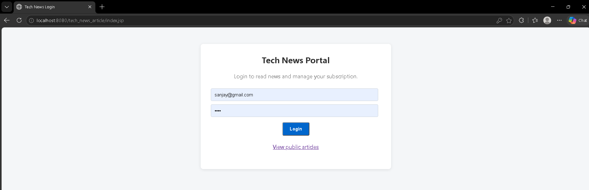
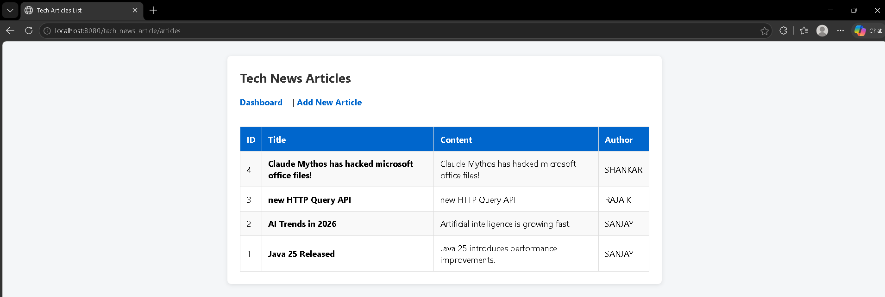
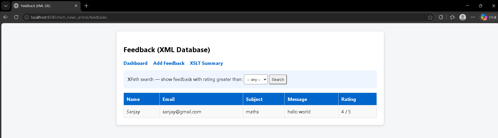

# Tech News Article Page

A Java web application for browsing and managing tech-news articles, with login, session handling, subscriptions, feedback, and active-user tracking. This repository includes the Eclipse web project and a Selenium browser-automation program.

## Features

- Login backed by MySQL and protected dashboard pages
- Add articles and browse the public article list
- Session timeout handling and active-session tracking
- Subscription and cookie-management flows
- Feedback stored as XML, validated against an XSD, with an XSLT summary
- Selenium automation for Chrome or Edge, covering page navigation, form entry, locators, links, and browser alerts

## Screenshots

Screenshots are intentionally pending. Upload the corresponding image files into [`screenshots/`](screenshots/) and replace each pending note below with an image when they are ready.

<div align="center">
  <h3>Login page</h3>
  
</div>

<div align="center">
  <h3>Article list</h3>
  
</div>

<div align="center">
  <h3>Feedback page</h3>
  
</div>

## Requirements

- JDK 26 for the web project as currently configured in Eclipse (`JavaSE-26`)
- Eclipse IDE for Enterprise Java and Web Developers, with Web Tools Platform
- Apache Tomcat 9
- MySQL Server
- JDK 26 for the Selenium project as currently configured in Eclipse
- Chrome or Edge for browser automation

## Configure MySQL

The app connects to `jdbc:mysql://localhost:3306/technewsdb` using the `root` / `root` credentials currently set in `tech-news-article/src/main/java/com/technews/util/DBConnection.java`. Create the database and login table, then add the demo account used by the Selenium script:

```sql
CREATE DATABASE IF NOT EXISTS technewsdb;
USE technewsdb;

CREATE TABLE IF NOT EXISTS users (
    id INT AUTO_INCREMENT PRIMARY KEY,
    name VARCHAR(100) NOT NULL,
    email VARCHAR(255) NOT NULL UNIQUE,
    password VARCHAR(255) NOT NULL
);

INSERT INTO users (name, email, password)
VALUES ('Sanjay', 'sanjay@gmail.com', 'root')
ON DUPLICATE KEY UPDATE name = VALUES(name), password = VALUES(password);
```

The app creates its articles table when an article is first added. The credentials and plain-text password check are for local/demo use only; configure secure credentials and password hashing before deployment beyond a local environment.

## Run with Eclipse and Tomcat 9

1. Start MySQL and complete the database setup above.
2. In Eclipse, choose **File > Import > Existing Projects into Workspace**.
3. Select the `tech-news-article` directory and finish the import.
4. Ensure Eclipse is configured with a JDK 26 and an Apache Tomcat 9 runtime. If `Apache Tomcat v9.0` is not listed, add it under **Window > Preferences > Server > Runtime Environments** and point it to your Tomcat 9 installation.
5. Right-click the imported **tech news article** project and choose **Run As > Run on Server**. Select Tomcat 9.
6. Open `http://localhost:8080/tech_news_article/`.

The web project's Eclipse facet and deployment settings already target Tomcat 9 and use the `tech_news_article` context path.

## Run the Selenium program

Start Tomcat and MySQL first, and make sure the demo login above exists. In Eclipse, import `SeleniumTest` as an existing project and run `TechNewsAutomation` as a Java application. Enter `1` for Chrome or `2` for Edge when prompted. Selenium Manager resolves the matching browser driver; the selected browser must be installed. The script uses `sanjay@gmail.com` / `root` and the local URL `http://localhost:8080/tech_news_article/`.

The Selenium Eclipse classpath currently points to Selenium 4.49 JARs on the original development machine. If Eclipse reports unresolved Selenium imports on your computer, update the project's Java Build Path to your local Selenium 4.49 JAR files.

## Repository layout

- `tech-news-article/` - requested Eclipse web application
- `SeleniumTest/` - Selenium automation Eclipse project
- `screenshots/` - reserved for the 2-3 page screenshots
- Repository root - pre-existing project files are retained unchanged

## Publishing status

This repository has been prepared locally. **Nothing has been committed or pushed.** Push only after the screenshots have been uploaded to `screenshots/` and the screenshot section above has been updated.
